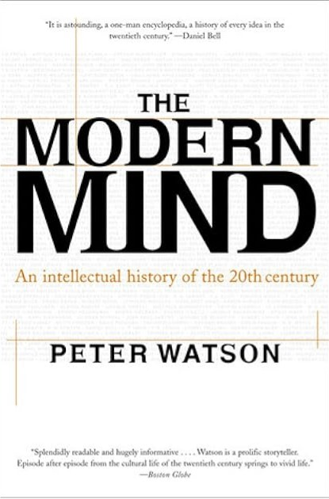

<head>  
    <link rel="stylesheet" href="styles.css">
</head>

**Published: {{Date}}**
<a href="books.md">

🇳🇴

</a>

I have always been fond of reading books. But the last couple of years it's exploded. I don't remember exactly <u>**when**</u> it started, but it is more than ten years ago. I remember <u>**how**</u> it started though.
I have worked in the oil industry with modelling of oil and/or gas reservoirs.

</img>

There is a lot one doesn't know about these. They are found many hundreds, if not thousands of meters below the surface. The fields in the North Sea are found under the seabottom, and then buried under several thousands meters of rock. That means that we have a pretty hazy picture about the details down there. Therefore we make digital models that are used for planning. These models contain a lot of assumptions, and many of them can be wrong. As a modeller you are the person behind many of these assumptions. To become better at this job I started to read about how our brains work, and especially about the topic of cognitive bias. Simply put these are ways our brain can make us get things wrong. Not because you are stupid or something like that, but because your brain is not a computer, but part of a biological being.

</img>
The most famous book on this topic is the book by **Daniel Kahneman** called _Thinking fast and slow_. He describes how many of the fast ways that the brain works has been central to our survival, especially early in the development of humanitity. But, it is also a source of fallacies in our thinking. There isn't really any way to avoid these fallacies, your brain is made this way. The only thing you can do is try to be aware of the fact that we all have them. And ideally be prepared to get input from others. This made me wonder, what type of fallacies do I carry with me?

Round about the same time, as mentioned earlier I cannot remember specifically, I read the book _The modern mind_ by **Peter Watson**. It's a fantastic book about the intellectual development from year 1900 to year 2000. I started reading the book because a colleague of mine recommended he thought it gave a really good overview about everything that happened in science in the 20th century. It was fun to read about that, I agree, but I was equally fascinated by the development in the social sciences. I read about sociological theories about how humans relate to each other in _The lonely crowd_ by **David Riesman**, criticism of tecnology from **Horkheimer and Adorno** in the _Dialectic of the Enlightment_, how **J.K Galbraith** was of the opinion that the American society didn't need to focus so much on expanding production and developing tecnology further allready at the end of the fifties (in the _The Affluent Society_) and lots more.

</img>

I read _Silent spring_, which is described as the first book on environmental protection by **Rachel Carson**, and _Limits to growth_ by **Donella Medows** and others , amongst them norwegian **Jørgen Randers**. All of this changed me, and my relationship to the world. Since then I have read a whole bunch of these books, and it has also had a snowball effect.

</img>
Now I read all the time, while my wishlist is just growing longer. It has become many, many books. I guess the common denominator is that they all are about humanity, and how we behave on this planet. If you want to see the list, you can find it just below. Some of the books are in Norwegian, and I have kept the Norwegian titles of them, but if you hover you should see my translation of the title.

## 📚 Books about the state of the world

Applebaum, A. (2020). _Twilight of Democracy: The Seductive Lure of Authoritarianism._ Knopf Doubleday Publishing Group.  
Ariely, D. (2009). _Predictably irrational_ HarperCollins UK.  
Ayres, R. U., & Ayres, E. H. (2009). _Crossing the Energy Divide: Moving from Fossil Fuel Dependence to a Clean-Energy Future._ Pearson Prentice Hall.  
Bardhan, P. (2022). _A World of Insecurity: Democratic Disenchantment in Rich and Poor Countries._ Harvard University Press.  
Barnes, P. (2014). _With Liberty and Dividends for All: How to Save Our Middle Class When Jobs Don’t Pay Enough._ Berrett-Koehler Publishers.  
Bjørkdahl, K., & Lykke, K. V. (2023). [_Hva vi spiser når vi spiser kjøtt._](## "What we eat when we eat meat") Res Publica.  
Bloodworth, J. (2018). _Hired: Six Months Undercover in Low-Wage Britain._ Atlantic Books.  
Brand, U., & Wissen, M. (2021). _The Imperial Mode of Living: Everyday Life and the Ecological Crisis of Capitalism._ Verso Books.  
Brøgger, J. (1993). _Kulturforståelse: En nøkkel til vår internasjonale samtid._ Damm.  
Bullough, O. (2018). _Moneyland: Why Thieves And Crooks Now Rule The World And How To Take It Back._ Profile Books.  
Burnett, D. (2016). _The Idiot Brain: A Neuroscientist Explains What Your Head is Really Up To._ Guardian Faber Publishing.  
De Oliveira, V. M. (2021). _Hospicing modernity: Facing humanity’s wrongs and the implications for social activism._ North Atlantic Books.  
DiAngelo, R. (2019). _White Fragility: Why It’s So Hard for White People to Talk About Racism._ Penguin UK.  
Dixson-Declève, S., Gaffney, O., Ghosh, J., Randers, J., Rockström, J., & Stoknes, P. E. (2022). _Earth for all: A survival guide for humanity : a report to the Club of Rome (2022) fifty years after The Limits to Growth (1972)._ New Society Publishers.  
Dorling, D. (2020). _Slowdown: The End of the Great Acceleration—and Why It’s Good for the Planet, the Economy, and Our Lives._ Yale University Press.  
Durkheim, É. (1951). _Suicide: A Study in Sociology (G._ Simpson, Red.; J. A. Spaulding & G. Simpson, Overs.). The Free Press.  
Fisher, M. (2009). _Capitalist Realism: Is There No Alternative?_ John Hunt Publishing.  
Fisher, R., & Ury, W. (2012). _Getting to Yes: Negotiating an agreement without giving in._ Random House.  
Frankl, V. E. (2017). _Man’s Search for Meaning._ Beacon Press.  
Fukuyama, F. (2006). _The End of History and the Last Man._ Simon and Schuster.  
Fukuyama, F. (2014). _Political Order and Political Decay: From the Industrial Revolution to the Globalisation of Democracy._ Profile Books.  
Fukuyama, F. (2018). _Identity: The Demand for Dignity and the Politics of Resentment._ Farrar, Straus and Giroux.  
Gabrielsen, B. (2020). [_Skjermslaver._](## "Screen slaves") Kagge forlag as.  
Garces, M. (2024). _New Radical Enlightenment: Philosophy for a Common World._ Verso Books.  
Giblin, R., & Doctorow, C. (2022). _Chokepoint Capitalism._ Beacon Press.  
Gleeson-White, J. (2015). _Six Capitals, or Can Accountants Save the Planet?: Rethinking Capitalism for the Twenty-First Century._ W. W. Norton & Company.  
Goodhart, D. (2017). _The Road to Somewhere: The Populist Revolt and the Future of Politics._ Oxford University Press.  
Graeber, D. (2012). _Debt: The First 5000 Years._ Penguin Books Limited.  
Gray, J. (2015). _Straw Dogs: Thoughts On Humans And Other Animals._ Granta Books.  
Habermas, J. (1989). _The Structural Transformation of the Public Sphere: An Inquiry Into a Category of Bourgeois Society._ Polity Press.  
Harari, Y. N. (2014). _Sapiens: A Brief History of Humankind: The multi-million copy bestseller._ Random House.  
Hickel, J. (2020). _Less is More: How Degrowth Will Save the World._ Random House.  
Hippe, I. (2021). [_Korstoget mot velferdsstaten: På innsiden av nyliberale tenketanker._](## "The crusade against the welfare state: On the inside of neoliberal think tanks") Svein Sandnes Bokforlag.  
Horkheimer, M., Adorno, T. W., & Noeri, G. (2002). _Dialectic of Enlightenment._ Stanford University Press.  
Hull, R. B., Robertson, D. P., & Mortimer, M. (2020). _Leadership for Sustainability: Strategies for Tackling Wicked Problems._ Island Press.  
Isaksen, T. R. (2023). [_Ingen tror på nåtiden: Drømmene fra 1989, hvorfor verden blir mørkere og jakten på lyspunkter._](## "Nobody believes in the present: The dream from 1989, why the world has gotten darker, and the hunt for bright spots") Kagge Forlag.  
Jackson, T. (2016). _Prosperity without Growth: Foundations for the Economy of Tomorrow._ Taylor & Francis.  
Jackson, T. (2021). _Post Growth: Life after Capitalism._ John Wiley & Sons.  
Jeffries, S. (2022). _Everything, All the Time, Everywhere: How We Became Postmodern._ Verso Books.  
Kahneman, D. (2011). _Thinking, Fast and Slow._ Penguin UK.  
Klein, N. (2019). _On Fire: The Burning Case for a Green New Deal._ Penguin UK.  
Lasch, C. (1991). _The Culture of Narcissism: American Life in an Age of Diminishing Expectations._ W. W. Norton & Company.  
Latour, B. (2018). _Down to Earth: Politics in the New Climatic Regime._ John Wiley & Sons.  
Lindgren, L. (2021).[ _Ekko: Et essay om algoritmer og begjær._](## "Echo: an essay on algorithms and") Gyldendal.  
Lykkeberg, R. (2019). [_Vesten mod Vesten: Fortællinger om det politiske opbrud fra efterkrigstiden til Brexit og Trump (1._ utg.).](## "The west against the west: stories about political upheaval from the postwar to Brexit and Trump") Informations Forlag.  
Marsdal, M. E. (2021). [_Parterapi: For oljefolk og klimaaktivister._](## "Couples therapy: For oil workers and climate activists") Manifest forlag.  
Mbembe, A. (2020). _Necropolitics._ Duke University Press.  
Mbembe, A. (2022). _The Earthly Community: Reflections on the Last Utopia._ V2*Publishing.  
McDonough, W., & Braungart, M. (2013). \_The Upcycle: Beyond Sustainability--Designing for Abundance.* Farrar, Straus and Giroux.  
McGuire, B. (2022). _Hothouse Earth: An Inhabitant’s Guide._ Icon Books.  
Meadows, D. (2008). _Thinking in Systems: International Bestseller._ Chelsea Green Publishing.  
Meadows, D., Randers, J., & Meadows, D. (2004). _Limits to Growth: The 30-Year Update._ Chelsea Green Publishing.  
Merchant, B. (2023). _Blood in the Machine: The Origins of the Rebellion Against Big Tech._ Hachette UK.  
Michaels, F. S. (2011). _Monoculture: How One Story Is Changing Everything._ Red Clover Press.  
Milanovic, B. (2023). _Visions of Inequality: From the French Revolution to the End of the Cold War._ Harvard University Press.  
Mildenberger, M. (2020). _Carbon Captured: How Business and Labor Control Climate Politics._ MIT Press.  
Mishra, P. (2019). [_Raseriets tidsalder._](## "Age of anger") Solum forlag as.  
Mjaaland, M. T., Eriksen, T. H., & Hessen, D. O. (2024). [_Antropocen: Menneskets tidsalder._](## "Anthropocene: The age of humans") Res Publica.  
Monbiot, G. (2004). _The Age of Consent: A Manifesto for a New World Order._ Harper Perennial.  
Monbiot, G. (2013). _Feral: Searching for Enchantment on the Frontiers of Rewilding._ Penguin UK.  
Moyn, S. (2023). _Liberalism Against Itself: Cold War Intellectuals and the Making of Our Times._ Yale University Press.  
Nair, C. (2022). _Dismantling Global White Privilege: Equity for a Post-Western World._ Berrett-Koehler Publishers.  
Nørmark, D., & Jensen, A. F. (2018).[ _Pseudoarbejde: Hvordan vi fik travlt med at lave ingenting (1._ utg.).](## "Pseudowork: how we got busy doing nothing") Gyldendal Business.  
Piketty, T. (2015). _The Economics of Inequality._ Harvard University Press.  
Piketty, T. (2020). _Capital and Ideology._ Harvard University Press.  
Polman, P., & Winston, A. (2021). _Net Positive: How Courageous Companies Thrive by Giving More Than They Take._ Harvard Business Press.  
Rathi, A. (2024). _Climate Capitalism: Winning the Race to Zero Emissions and Solving the Crisis of Our Age._ Greystone Books Ltd.  
Raworth, K. (2018). _Doughnut Economics: Seven Ways to Think Like a 21st Century Economist._ Chelsea Green Publishing.  
Read, R., & Alexander, S. (2019). _This Civilisation is Finished: Conversations on the end of Empire - and what lies beyond._ Simplicity Institute.  
Reinertsen, M. B. (2017). [_Reisen til Bretton Woods._](## "The journey to Bretton Woods") Cappelen Damm.  
Riesman, D., Glazer, N., & Denney, R. (2020). _The Lonely Crowd: A Study of the Changing American Character._ Yale University Press.  
Riise, A. B. (2021). [_Mitt klimaregnskap._](## "My climate accounting") Res Publica.  
Robinson, K. S. (2020). _The Ministry for the Future._ Hachette UK.  
Rogan, T. (2019). _The Moral Economists: R. H. Tawney, Karl Polanyi, E. P. Thompson, and the Critique of Capitalism._ Princeton University Press.  
Rosa, H. (2019). _Resonance: A Sociology of Our Relationship to the World._ John Wiley & Sons.  
Rosling, H., Rönnlund, A. R., & Rosling, O. (2018). _Factfulness: Ten Reasons We’re Wrong About the World--and Why Things Are Better Than You Think._ Flatiron Books.  
Rushkoff, D. (2022). _Survival of the Richest: Escape Fantasies of the Tech Billionaires._ W. W. Norton & Company.  
Russell, B. (2008). _History of Western Philosophy._ Simon and Schuster.  
Russell, B. (2022). _The Problems of Philosophy._ DigiCat.  
Røyne, A. (2020). [_Varm klode, kaldt hode._](## "Hot earth, cool head") Kaldt hode. Kagge forlag as.  
Said, E. W. (1995). _Orientalism._ Penguin Books India.  
Slobodian, Q. (2023). _Crack-Up Capitalism: Market Radicals and the Dream of a World Without Democracy._ Random House.  
Snyder, T. (2017). _On Tyranny: Twenty Lessons from the Twentieth Century._ Crown.  
Stalsberg, L. (2021).[ _Etter pandemien: Tanker om krise, kapitalisme og en ny hverdag (1._ utg.).](## "After the pandemic: Thoughts about crisis, capitalism, and a new way of living") Manifest forlag.  
Stalsberg, L. (2022). _Det er nok nå: Hvordan nyliberalismen ødelegger mennesker og natur._ Forlaget Manifest AS.  
Stoknes, P. E. (2020). [_Grønn vekst: En sunn økonomi for det 21. århundre_.](## "Green growth: a healthy economy for the 21. century") Tiden norsk forlag.  
Stoknes, P. E. (med Jostein Sand Nilsen, & Stoknes, P. E.). (2017). [_Det vi tenker på når vi prøver å ikke tenke på global oppvarming._](## "What we think about when we try not to think about climate change") Tiden.  
Taleb, N. N. (2008). _The Black Swan: The Impact of the Highly Improbable._ Penguin UK.  
Tetlock, P. E. (2017). _Expert Political Judgment: How Good Is It? How Can We Know? - New Edition._ Princeton University Press.  
Tetlock, P., & Gardner, D. (2015). _Superforecasting: The Art and Science of Prediction._ Random House.  
Thaler, R. H., & Sunstein, C. R. (2021). _Nudge: The Final Edition._ Yale University Press.  
Thompson, H. (2022). _Disorder: Hard Times in the 21st Century._ Oxford University Press.  
Vetlesen, A. J., & Henriksen, J.-O. (2022). [_Etikk i klimakrisens tid._](## "Ethics in a time of climate crisis") Res Publica.  
Watson, P. (2023). _The Modern Mind: An Intellectual History of the 20th Century._ Harper Collins.  
Weber, M. (2011). _The Protestant Ethic and the Spirit of Capitalism (S._ Kalberg, Red.). Oxford University Press.  
Whyte, W. H. (2013). _The Organization Man._ University of Pennsylvania Press.  
Williams, J. (2021). _Climate Change Is Racist: Race, Privilege and the Struggle for Climate Justice._ Icon Books.  
Zuboff, S. (2019). _The Age of Surveillance Capitalism: The Fight for a Human Future at the New Frontier of Power._ Hachette UK.

<a href="index_english.md">🪃</a>
